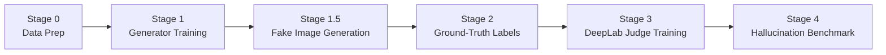

# Post-Hoc Hallucination Detector for SAR-to-Optical Image Translation
### Project Status Documentation

**Capstone Reference:** School of Computer Science (SOCS), UPES
**Team:** Ananya Karn (CCVT B3) · Hiten Gupta (DevOps B1) · Katyayini Singh (CSF B4) · Vyansh Sinha (DevOps B1)
**Repository:** `Post-Hoc-Hallucination-Detector-for-SAR-to-Optical-Image-Translation`

> **Status as of: September 21, 2026**
> Everything below reflects the project's state as of this date. Update this line (and the relevant sections) each time this document is revised, so anyone reading it always knows how fresh the information is.

---

## 1. What This Project Is

SAR-to-Optical translation converts all-weather radar imagery into human-readable optical-style images using generative models. The problem: these generators **hallucinate** — they invent plausible-looking content (a bridge that isn't there, dry land over floodwater) with full photorealistic confidence, and standard metrics (SSIM, PSNR, FID) are global scores that can't catch these localized, high-stakes errors.

**This project builds the first quantitative, per-land-cover-class hallucination benchmark** for SAR-to-Optical translation, using a novel double-condition filter:

> A pixel is labeled a **ground-truth hallucination** only if a fine-tuned DeepLabV3 segmentation model classifies it **correctly on the real optical image** but **incorrectly on the generated (fake) optical image.**

This isolates genuine generator errors from segmentation-model limitations, producing a reproducible, externally validated, architecture-agnostic auditing pipeline — usable on any current or future SAR-to-Optical generator.

**Dataset:** SEN12MS (Schmitt et al., 2019) — 180,662 co-registered Sentinel-1 (SAR) / Sentinel-2 (Optical) patch triplets.

---

## 2. The Pipeline, End to End



| Stage | What Happens |
|---|---|
| 0 | Download SEN12MS, split into train/val/test geographically |
| 1 | Train a SAR→Optical generator (we trained **three**, see below) |
| 1.5 | Use the trained generator to produce fake optical images for the entire held-out test set |
| 2 | Generate pixel-accurate land-cover ground truth (ESA WorldCover) for those same test patches |
| 3 | Fine-tune a DeepLabV3 segmentation model as the "judge," on real optical images |
| 4 | Run the judge on real *and* fake images for every test patch → apply the double-condition filter → produce a per-class hallucination rate table |

---

## 3. What's Been Completed

### ✅ Stage 0 — Data Preparation
- `autorun.sh` — downloads all 4 seasons of SEN12MS (~180 GB) via rsync
- `00_prepare_splits.py` — 80/10/10 **geographic** ROI-based train/val/test split (seed=42), avoiding spatial leakage between splits
- Split sizes: train ≈144K patches, val ≈18K patches, test ≈18K patches (`splits/*.json`)

### ✅ Stage 1 — Generator Training (three models, exceeding original scope)

The original proposal committed to a **pix2pix baseline only**. The team went further and trained three generators for comparison:

| Model | Architecture | Training Approach | Status |
|---|---|---|---|
| **Pix2Pix** | U-Net Generator + PatchGAN Discriminator | Paired supervision, L1 pixel loss (λ=100) | ✅ Trained, 30 epochs, evaluated |
| **CycleGAN** | ResNet-9 Generator + PatchGAN (×2 each) | Unpaired, cycle-consistency loss (λ=10) | 🔵 **In progress — actively training now** |
| **Palette** (diffusion) | Conditional U-Net + self-attention, DDPM/DDIM | T=1000 diffusion steps, classifier-free guidance | ⚠️ Trained, 30 epochs — **sampler bug fixed and re-run, but hallucination rate is still not meaningfully improved. See Section 4.** |

### ✅ Stage 1.5 — Fake Image Generation
`generate_new_fakes.py` — a single universal script supporting all three models. Resume-safe, NaN-detects and auto-skips corrupted patches, writes GeoTIFFs with multithreaded I/O.

### ✅ Stage 2 — Ground-Truth Labels (Upgraded from Proposal)
> **Scope improvement:** the proposal specified MODIS IGBP labels (500m resolution, 17 classes). The team pivoted to **ESA WorldCover (10m resolution, 11 classes)** — a substantially higher-fidelity ground truth. Legacy MODIS scripts have been removed from the codebase.

- `05a_download_worldcover.py` — pulls required WorldCover tiles from AWS S3
- `05b_generate_worldcover_labels.py` — reprojects WorldCover into the exact SEN12MS patch grid

11 classes: Tree Cover, Shrubland, Grassland, Cropland, Urban/Built-up, Barren, Snow/Ice, Water Bodies, Wetlands, Mangroves, Moss/Lichen.

### ✅ Stage 3 — DeepLab Judge Training
`02b_train_deeplab_worldcover.py` — fine-tunes DeepLabV3-ResNet50 on real optical images against WorldCover labels, 15 epochs. Saved as `deeplabv3_finetuned_worldcover.pth`.

### ✅ Stage 4 — Hallucination Benchmark
`03b_evaluate_hallucinations_worldcover.py` implements the double-condition filter plus a **2-pixel morphological boundary erosion**, which mitigates false-positive hallucination labels caused by Sentinel-1/Sentinel-2 sub-pixel co-registration drift at class edges.

---

## 4. Current Results

### Pix2Pix — Valid, Usable Benchmark

| Land Cover Class | Detector Baseline Acc. | Hallucination Rate |
|---|:-:|:-:|
| Tree Cover | 95.67% | **2.80%** |
| Water Bodies | 92.19% | **3.42%** |
| Urban / Built-up | 97.04% | **26.03%** |
| Barren | 58.17% | **40.03%** |
| Grassland | 52.96% | **64.24%** |
| Cropland | 81.88% | **73.22%** |
| Shrubland | 36.40% | **87.89%** |
| Wetlands | 36.17% | **100.00%**¹ |
| Mangroves | 0.01% | **100.00%**¹ |
| Snow/Ice | N/A | N/A (0 pixels in test split) |
| Moss/Lichen | N/A | N/A (0 pixels in test split) |

¹ Very low sample count for this class — treat as noisy, not representative.

**Read of this table:** Pix2Pix is reliable on large, spectrally distinct classes (forest, water) and unreliable on classes it has few examples of or that are visually ambiguous from SAR alone (shrubland, wetlands). This is exactly the kind of finding the benchmark is designed to surface.

### Palette (Diffusion) — Fix Applied, Problem Persists — Needs Further Investigation

The original CSV showed ~100% hallucination on almost every class except Water Bodies (0.59%). Tracing the commit history against the CSV's generation timestamp identified two concrete code bugs as the likely cause:

- A sampler bug: it applied a **single-step DDPM formula while skipping ~10-20 timesteps per step**, which is only mathematically valid for single-step increments. This compounds error across the ~50-100 sampling steps, producing images that are structurally noise-dominated by the end of generation.
- A secondary bug: intermediate predictions were clamped to `[0,1]` while the rest of the pipeline was mid-migration to `[-1,1]` normalization.

**Update (Sept 21):** both fixes were already present in the codebase and have since been **re-run by a teammate** — regenerating Palette fakes and re-evaluating with the corrected DDIM sampler and consistent normalization. **The hallucination rate did not improve significantly.** This is an important finding in itself: it means the two code bugs were real bugs worth fixing, but they were **not the primary cause** of Palette's poor output quality. Something more fundamental is likely at play — candidates include:

- The checkpoint being used was trained on **raw, non-EMA weights** (the EMA + gradient-clipping stability fix landed in the training script *after* this model finished training, so it's never actually benefited from it) — diffusion models are known to be meaningfully noisier on raw weights even when training loss looks fine.
- The model may simply need more training epochs, a different learning rate schedule, or more classifier-free guidance strength at sampling time to properly condition on the SAR input rather than generating quasi-plausible-but-disconnected imagery.
- It's also possible the conditioning mechanism itself (how the SAR image is fed into the diffusion U-Net) has a deeper architectural issue that a sampler-level fix can't reach.

**Status: root cause is not yet fully understood.** This has moved from "quick fix, almost done" to an open investigation — see Section 6 for the plan.

### CycleGAN — Training In Progress
This is the team's current active work. Once training finishes, fake image generation and the hallucination evaluation will follow the same two-command process used for the other models (see Section 6).

---

## 5. Known Issues Log

| Issue | Where | Impact | Fix Status |
|---|---|---|---|
| Broken diffusion sampler (step-skipping bug) | old `generate_new_fakes.py` | Invalidated Palette benchmark | ✅ Fixed and re-run — **did not resolve the poor output quality** |
| Normalization clamp mismatch | same, during Palette migration to [-1,1] | Contributed to invalid Palette outputs | ✅ Fixed and re-run — **did not resolve the poor output quality** |
| Palette output quality still poor after both fixes | `01d_train_palette.py` / Palette pipeline generally | Palette hallucination benchmark still not usable | 🔴 **Open — root cause not yet identified, see Section 6** |
| Palette checkpoint trained on raw (non-EMA) weights | `01d_train_palette.py` | Leading suspect for the remaining quality issue | ✅ EMA + gradient clipping added to trainer, ⏳ not yet used to retrain |
| `dataset.py`'s shared `SEN12MSDataset` class is unused | repo-wide | Dead code; every training script defines its own inline dataset class instead | 🟡 Not blocking, cleanup item |
| `autorun.sh` calls `python train.py`, which doesn't exist | `autorun.sh` line 33 | Script would fail if run end-to-end unmodified | 🟡 Not blocking, cleanup item |
| CycleGAN + Palette architectures duplicated across training script and `generate_new_fakes.py` | repo-wide | Maintainability risk, not a correctness bug | 🟡 Not blocking, cleanup item |

---

## 6. What We're Planning To Do Next

### 🔵 Currently Doing

1. **Training CycleGAN.** This is the team's active task right now. Once training completes, the same generate → evaluate steps used for Pix2Pix and Palette will be run to produce its benchmark:
   ```bash
   python3 generate_new_fakes.py --model cyclegan
   python3 03b_evaluate_hallucinations_worldcover.py --model cyclegan
   ```

### 🔴 Critical — Blocking Capstone Deliverables

2. **Compute standard generator quality metrics — PSNR, SSIM, FID.** Required by the proposal's Evaluation Plan, to confirm each generator is representative of state-of-the-art quality *before* the hallucination audit is treated as meaningful. No script exists for this yet.

3. **Comparative summary table** — Pix2Pix vs. CycleGAN vs. Palette, side by side: per-class hallucination rate, PSNR, SSIM, FID, detector accuracy. This is the centerpiece deliverable for the report. (Currently blocked on CycleGAN's benchmark and a resolved-or-documented Palette result.)

### 🟡 Important — Report Quality

4. **Manual spot-check validation.** Build a visualization script overlaying the hallucination mask on real/fake image pairs, sampled per land-cover class, for human review against the proposal's stated validation plan.

5. **Statistical validation across geographic splits.** Bootstrap confidence intervals for per-class hallucination rates; per-ROI variance to demonstrate geographic stability of the findings.

### 🟣 Later — The Diffusion Model Question

6. **Revisit what to do about Palette, once CycleGAN is wrapped up.** The two known code bugs are fixed, but fixing them didn't meaningfully improve output quality — so this isn't a quick patch anymore, it's an open question worth dedicated time. Once the CycleGAN benchmark is done, the plan is to properly investigate this rather than guess further, likely in this order:
   - **Retrain with the EMA + gradient-clipping fix** (already written, never used) — cheapest thing to try first, since it reuses the existing setup and just needs a fresh ~30-epoch run.
   - **If that doesn't fix it, do a proper visual/quantitative diagnosis** — look at generated images at intermediate diffusion steps, not just the final output, to see where quality actually breaks down, and compute PSNR/SSIM specifically on Palette outputs to see if the problem is global blur/noise or specific to certain regions.
   - **Only after that, consider whether a different, more budget-friendly diffusion approach is worth trying** (e.g. a lighter/latent version, or simply relying on Pix2Pix and CycleGAN as the two primary generators and reporting Palette as a limitation/future-work item rather than a full third benchmark) — decided based on how much AWS credit remains and how much time is left before the report is due.

### 🟢 Nice-to-Have — Strengthens the Paper

7. Hallucination heatmaps by geography (using patch GPS metadata) — where do failures cluster spatially?
8. Cross-model confusion matrices — which class gets hallucinated *into* which other class (e.g. Water → Land)?
9. Code cleanup — extract duplicated CycleGAN/Palette architecture code into shared modules; remove or wire up `dataset.py`; fix or remove the dead `train.py` reference in `autorun.sh`.

---

## 7. Budget Constraint & Compute Strategy

Training is being run on AWS using a **$100 free-credit ceiling**, so the plan deliberately avoids expensive architecture changes wherever a config-level or code-level fix is available first:

- The near-zero-cost Palette fix (re-running inference + evaluation on the existing checkpoint, no retraining) has already been done — it was the cheapest possible move, and it's now confirmed **not sufficient on its own**.
- The next cheapest lever is **retraining Palette with the existing EMA + gradient-clipping fix**, ~10-15 GPU-hours on a T4-class instance (a few dollars on spot pricing) — well within budget, and this cost has effectively already been spent once before.
- **CycleGAN training (currently in progress) is the immediate compute priority**, since it's a known, well-understood cost and directly unblocks the 3-model comparison table.
- **No plan to switch to a heavier diffusion architecture** (e.g. full latent diffusion, consistency-model distillation) unless the retrain-with-EMA attempt also fails — those options carry meaningfully higher engineering and compute cost, and the budget is better spent finishing CycleGAN and validating Pix2Pix/CycleGAN thoroughly than chasing an uncertain diffusion fix indefinitely.

---

## 8. Timeline Mapping

| Proposal Milestone | Planned Deliverable | Current Status |
|:-:|---|:-:|
| **M1** | Literature survey; SEN12MS download & preprocessing | ✅ Complete |
| **M2** | Train pix2pix baseline; validate convergence | ✅ Complete — exceeded scope (3 generators trained) |
| **M3** | Synthetic generation, double-condition filter, per-class table | ⚠️ Partially complete — Pix2Pix done; CycleGAN training in progress; Palette re-run complete but still unresolved (open investigation); PSNR/SSIM/FID missing |
| **M4** | Statistical validation across geographic splits; Capstone 1 report | 🔴 Not started |

---

## 9. Quick Reference — Repository Map

| File / Folder | Purpose |
|---|---|
| `00_prepare_splits.py` | Train/val/test geographic split |
| `01b_train_pix2pix.py` / `01c_train_cyclegan.py` / `01d_train_palette.py` | The three generator trainers |
| `models.py` | Pix2Pix U-Net Generator + PatchGAN Discriminator |
| `generate_new_fakes.py` | Universal inference script for all 3 models |
| `05a_download_worldcover.py` / `05b_generate_worldcover_labels.py` | ESA WorldCover ground-truth pipeline |
| `02b_train_deeplab_worldcover.py` | Fine-tunes the DeepLab judge |
| `03b_evaluate_hallucinations_worldcover.py` | The double-condition hallucination filter — core contribution |
| `plot_training_curve.py` | Training convergence plots for all 3 models |
| `splits/` | Train/val/test file lists (JSON) |
| `docs/README.md` | Full Capstone 1 proposal document |
| `hallucination_benchmark_worldcover_*.csv` | Per-class results (Pix2Pix valid, Palette stale) |
| `autorun.sh` | One-shot SEN12MS download script (has a known dead reference, see Section 5) |

---

*This document reflects the project's status as of September 21, 2026. Update the "Status as of" line at the top and the relevant sections each time this document is revised, so anyone reading it always knows how current the information is.*
